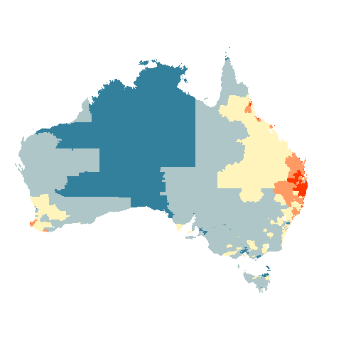

```{r setup, include=FALSE}
knitr::opts_chunk$set(echo = FALSE)
```

# The Australian Cancer Atlas


```{r fig.cap = "A choropleth map of the distribution of Standardised Incidence Rates of melanoma cancer for Australians."}
knitr::include_graphics("kobakian_sugarbag_jss/figures/aus_melanoma_p.png")
```


```{r fig.cap = "A hexagon tile map distribution of Standardised Incidence Rates of melanoma cancer for Australians."}
knitr::include_graphics("kobakian_sugarbag_jss/figures/aus_melanoma_p_hex.png")
```


This is an animation that changes from a choropleth map to a hexagon tile map of Australian Statistical Areas at Level 2 using Standardised Incidence Ratios taken from the Australian Cancer Atlas website.

```{r}

```

